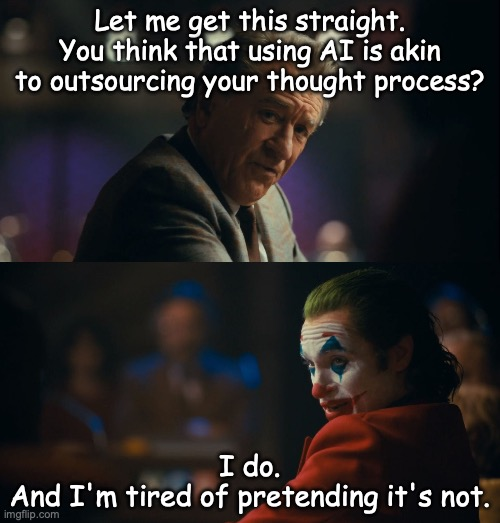

## *Don't let AI be your voice. It's not you!*

The Internet is being flooded with AI-generated content.

With every passing day, there are more LinkedIn posts, blogs, code, and multimedia content that's generated by AI.

Sure, the people behind the content are still "real" humans (I hope) who use AI to "supercharge" their ideas, but the content itself is ***infested*** with AI-generated gibberish that makes sense only because the neural network behind the AI has figured out ways to weave words & pixels together to create something seemingly coherent.

The narrative that is being put out there (by individuals & companies alike) is that as long as the idea behind something that's created comes from an organ filled with biological neurons, it is considered to be a human creation. That the AI is just helping with the seamless execution and nothing more.

These people couldn't be more wrong!

Execution is everything, and the human involvement in the execution is what enriches the human mind!

If you think execution is just grunt work, take a moment to recall the number of times that you've thought about starting your own company when you were frustrated with your job.

You may have had thousands of good ideas, but none of them actually panned out because you were too lazy to lift a finger!

AI can give an execution plan, but it can't check its validity. And it sure as heck won't play your part in it!

If you are a fan of ***Iron Man***, you would know that it was Tony Stark who was key to the invention of his suit and the subsequent enhancements to it.

Heck, he even invented an entirely new element to power his suit when his body was being slowly poisoned by Palladium, the element used to power the Arc reactor implanted in his chest.

Given that ***Jarvis*** is depicted as a very capable "AI assistant" in the movie, it should have been the one to suggest this idea to Tony.

After all, it claimed to have scoured the entire Periodic table in search of an alternative to Palladium.

But ultimately it was Tony who took the initiative that led to the invention.

If Tony had just sat around waiting for his death, Jarvis wouldn't have done shit to save him!

If that's not enough to convince you about the frivolity of AI, here's an example from my life:

I have been meaning to put out this post for the last one month or so, but I couldn't because I wasn't even making an effort to come up with a good title, let alone write the rest of the post.

Sure, I could have just asked ChatGPT to write it for me, but then the situation couldn't have been more ironic: a post about the superficiality of AI written by an AI!

So, it was me who had to make the effort to kickstart my thinking and type the words that you are reading now.

By delegating the execution to AI, you are essentially outsourcing the thought process that could provide you with valuable insights into "why" your idea is good or why it isn't!

And that helps you become a better version of yourself, something that AI can't do for you!

 