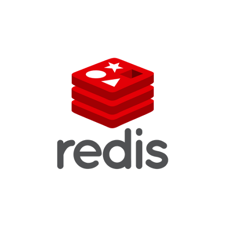

### The Redis Cache Nightmare: How We Fixed It with One Simple Command

Redis. The undisputed king of caching. Mention caching, and Redis pops up. It's that simple.

When you cache data in Redis, you’ll need to refresh or remove it at some point unless Redis is your primary database. Here's a lesson we learned about doing this the right way.

We use Redis to store "master" data—like city pincodes—that's vital for user journeys. Most of this data is static, but some changes daily. When it does, we flush the stale data from Redis before updating the new data in the database, which then syncs with Redis.

We built a utility for this. It ensures that if stale data isn’t cleared from Redis, the database update doesn’t proceed. This setup worked great until one day, it didn't. The utility kept failing to clear Redis, and thus, refused to update the database.

Investigation revealed the utility was getting a "timeout" error from Redis, even though the Redis server was fine and handling requests perfectly.

The culprit? The Redis client settings. We used the spring-data-redis library, and the client's connection timeout was set to 700 milliseconds. We bumped it to 5000 milliseconds. Problem solved, right? Wrong. The timeout error reappeared after a few days.

In a bind, we had to disable Redis, forcing our system to read master data directly from the database. This increased DB load and hurt performance.

Redis, our superpower, became our Achilles' heel.

With no solutions from Google or StackOverflow, I dug into the spring-data-redis source code. The root cause? We used two separate method calls to clear the cache: one to enumerate all keys and another to delete them. This setup could result in thousands of network calls, causing the timeout.

Enter the FLUSHALL command. A single command that clears the cache in one go. Even better, it has an ASYNC mode, assigning the task to a separate thread so the main thread isn’t blocked.

The problem wasn’t with Redis or the spring-data-redis library. It was our oversight.

Lesson learned: Keep it simple, use FLUSHALL. Redis remains our caching king.

